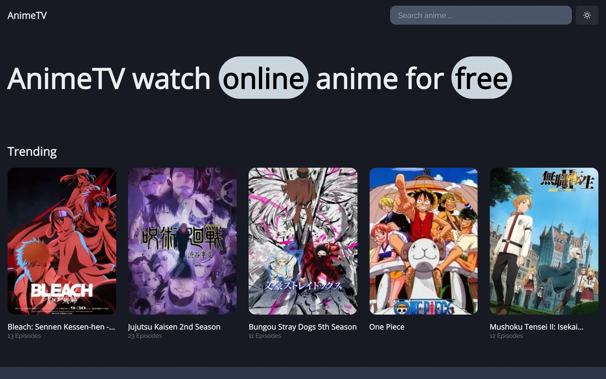

<!-- markdownlint-disable MD014 -->
<!-- markdownlint-disable MD026 -->
<!-- markdownlint-disable MD033 -->
<!-- markdownlint-disable MD041 -->

<h1 align="center">
  Anime-TV
</h1>

<!-- Banner Section -->

  

<h3 align="center">
  Watch anime online, the ultimate destination for anime enthusiasts of all ages and interests.
</h3>

## 🚀 [Watch NOW →](https://anime-tv-delta.vercel.app/) 🚀
---

<!-- Introduction Section -->

## 📖 Introduction

This project uses NextJS as core of the technology combined with all the the **best practices** of **[JAMStack](https://jamstack.org)**.
